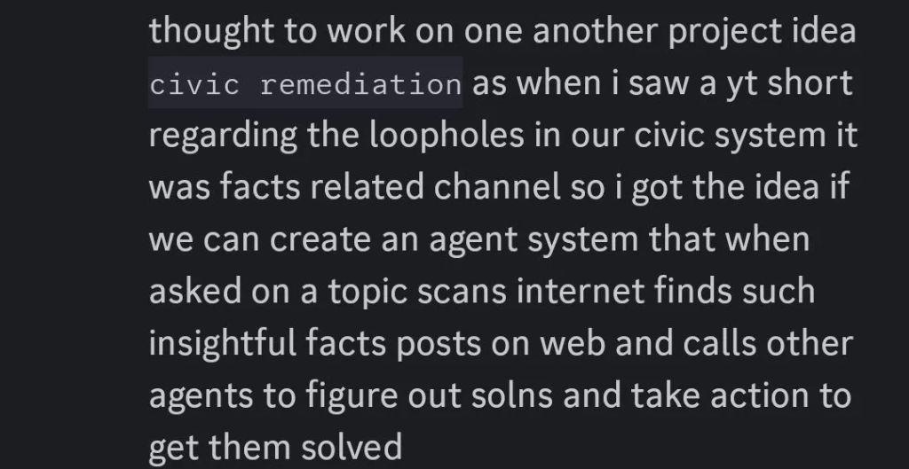

<p align="center">
  
</p>

<h1 align="center">Civic Remediation System</h1>

<p align="center">
  <strong>AI agents that find civic problems, trace root causes, and secure funding to fix them.</strong>
</p>

<p align="center">
  <a href="https://opensource.org/licenses/MIT"></a>
  <a href="https://discord.gg/g95mrWGm4G"></a>
  <a href="https://x.com/AgentraLabs"></a>
</p>

---

## 🎯 What It Does

| Step | Agent | Action |
|------|-------|--------|
| 1 | 🔭 **Sentinel** | Scans news/socials → selects **ONE** high-impact problem |
| 2 | 🔎 **Investigator** | Digs deep → identifies **ONE** root cause |
| 3 | 🏛️ **Bureaucrat** | Maps bureaucracy → targets **ONE** responsible department |
| 4 | 🛠️ **Engineer** | Architects fix → designs **ONE** technical solution |
| 5 | 🤝 **Liaison** | Scans funding → secures **ONE** grant/scheme |

**Output:** A complete project blueprint ready for execution.

---

## 🚀 Quickstart

```bash
curl -LsSf https://astral.sh/uv/install.sh | sh  # Install uv
uv sync                                           # Install deps
docker compose up -d                              # Start database
uv run python -m app.main "Pollution of the Ganga River"
```

**Want a UI?** Run `uv run -m app.agent_os` → visit [os.agno.com](https://os.agno.com)

---

## 🛠️ Stack

| Layer | Tech |
|-------|------|
| Framework | [Agno](https://agno.com) |
| Models | Perplexity / Mistral |
| Memory | PostgreSQL + pgvector |
| Tracing | LangWatch |

---

## 🧑‍💻 Contributing

We're building in public. Here's how to jump in:

1. **Star the repo** — helps others find us
2. **Join [Discord](https://discord.gg/g95mrWGm4G)** — discuss ideas, get help
3. **Pick an issue** — check `good first issue` labels
4. **Read [AGENTS.md](./AGENTS.md)** — understand our dev standards

This repo uses **Nia MCP** (semantic search) and **Polydev MCP** (persistent context) for enhanced developer experience.

---

<p align="center">
  <a href="https://discord.gg/g95mrWGm4G"><strong>💬 Join the Community</strong></a> · 
  <a href="https://x.com/AgentraLabs"><strong>🐦 Follow Updates</strong></a>
</p>

<p align="center">
  <sub>Built by <a href="https://x.com/AgentraLabs">AgentraLabs</a> · MIT License</sub>
</p>
